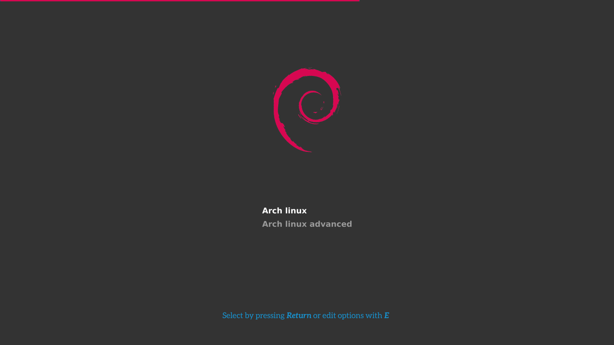

# Debian-Silence GRUB2 theme

This is my take on the [arch-silence](https://github.com/fghibellini/arch-silence) GRUB2 theme.

I just changed the arch logo for the debian logo and changed the color blue to red, all credit goes to the original author

Note: I haven't changed the helpbar yet as it required more than 5 minutes, I'll do it eventually :D

I know i just photoshopped the preview image but i did the same for the resources so...

## Installation

You can either clone the repo and run install.sh or i have already packaged it if you want to apply it with [grub-customizer](https://launchpad.net/grub-customizer)
* [:arrow_down: v0.1](../../releases/download/v0.1/debian-silence-0.1.tar.gz)

### Original Author:

[Filippo Ghibellini](https://github.com/fghibellini)

